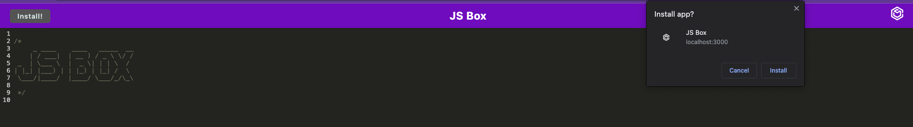
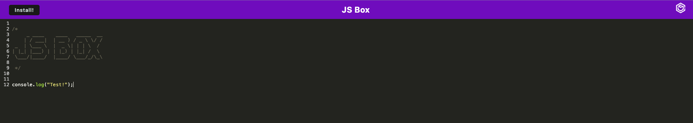

# JS Box

## Description

A browser based text editor with javascript syntax highlighting.

## Table of Contents

-[Installation](#installation)

-[Usage](#usage)

-[Credits](#credits)

-[Tests](#tests)

-[License](#license)

-[Questions](#questions)

## Installation

This application can be installed by clicking the `Install!` button in the top left corner. This allows the application to be used when offline.

## Usage

This application is currently deployed at: https://tinyurl.com/2p9xawvp

In order to use this application you can click in the window and simply start typing. The JavaScript syntax highlighting will occur automatically.

## Credits

This project makes use of express, webpack, and node.

## Tests

N/A

## License

This project is licensed under the MIT license.

## Questions

If you have any questions, please contact me at chasegarrett@tutanota.com. You can also visit my [GitHub](https://github.com/Chase-Garrett) for more of my work.
